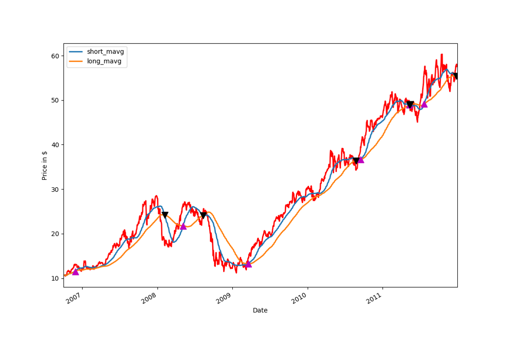
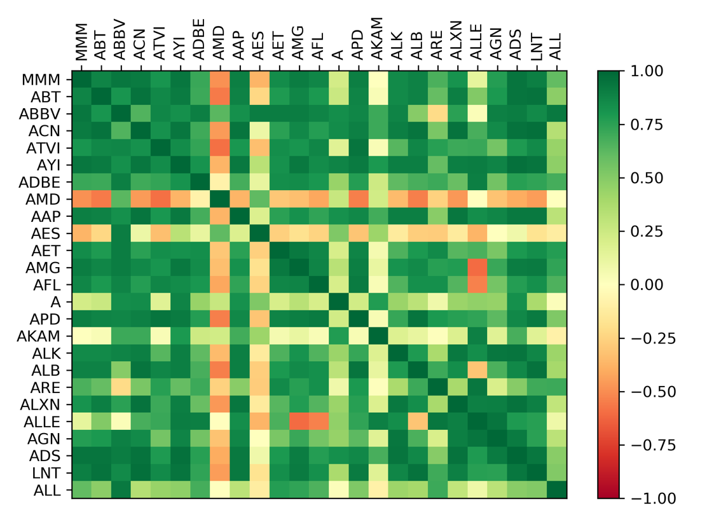
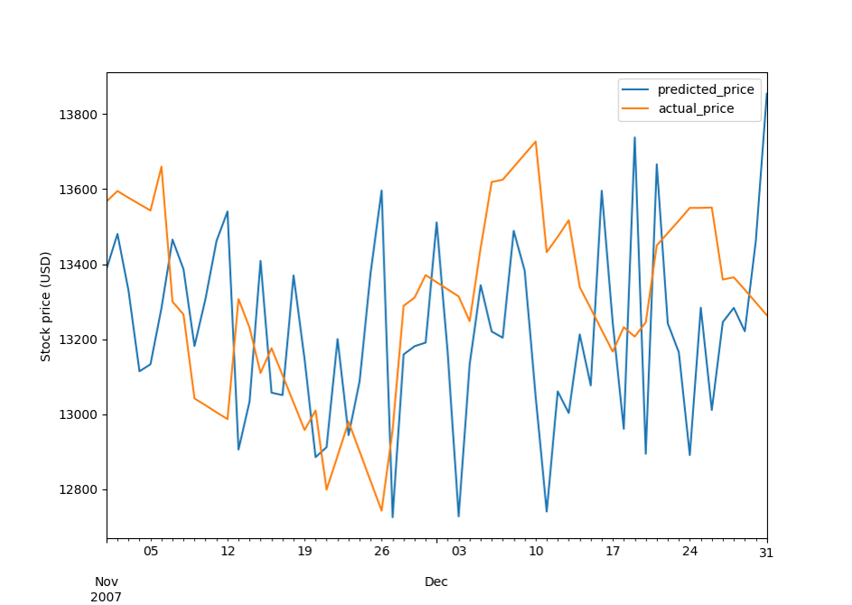

# Predicting-stock-s-prices-via-ML
This project aims at making predictions of stock's prices. We trained ML models on many years of historical price data from S&amp;P 500, as well as sentiment analysis from news headlines.

##The Big picture

This project aims at making predictions of stock's prices.

Current status about (some) stocks forecast strategies:

* stock's percent change
* momentum strategy (Turtle trading, Quandl)
* (double) reversion strategy
* Box–Jenkins (ARIMA)
* Prophet (identifies Trend + Seasonality + Noise)
* Hedge fund models

## To get a feeling about forecasts: Box Jenkins (ARIMA), Prophet

##To get a feeling about trading strategies: momentum strategy

###Goal of the current project

* asses whether we can find independent proxies of trends/patterns of the stock's prices.

* Improving current forecast/trading strategies

* Predict the price of a stock using Machine Learning:
We'll train ML models on many years of historical price data and including all the data from SP500, as well as sentiment analysis from news headlines 

###Lets pause for a sec… Why all the SP500?

Let's look into the correlation of all of these companies, red for negative correlations, green for positive correlations, and yellow for no-correlations

The majority of companies are positively correlated, but there are still quite a few that are very negatively correlated.

We can also see there are many companies with no correlation at all.

#### ML could recognize and trade based purely on these relationships.

## Let’s pause for another sec: why sentiment analysis?

The impact of human emotions on trading decisions is often the greatest hindrance to performance for standard forecast/trading strategies.

This is where ML systems can be incredibly helpful tools for humans navigating the decision-making process involved with investments, human emotion and risk assessment

* Technique used: VADER sentiment analysis tools within nltk for NY Times headlines

__Stock price predictions via Sentiment analysis__

## ML and AI in Hedge funds

In order to strengthen our predictions, we used a wealth of market data, such as stocks from SP500, etc. in our model, in addition to the historical returns of relevant assets, as well as sentiment analysis from articles from news.

This resulted in over 500 features we used to make final predictions, and about 20 GB of data ML models implemented: __Neural networks and Voting classifiers__.

Technologies: __scikit-learn, Keras, Tensorflow__ 

__Trading techniques used__: percent change and momentum of stock prices

## Results (…the serious ones)

* Backtesting Pitfalls on historical prices
* Combining these ML models created an __investment strategy which generated an (5%)8 % annualized return on selected stocks, which was (15%)23% higher than other benchmark strategy__ tested over a one year period. 

Metric used to quantify returns:

__Compound Annual Growth Rate__

CAGR = (EV/BV)^(1/n)-1

## Results (the less-serious ones…)

It appears that stock prices correlates more strongly with pos than neg sentiments.

Hence, my results could be summarized as:
__The Optimism of the trades__

## What to explore next: LSTM

__Tecnology: Keras and TensorFlow__

For a lot of the price movements, especially the big ones, there is quite a correlation between our model prediction and our actual data.
